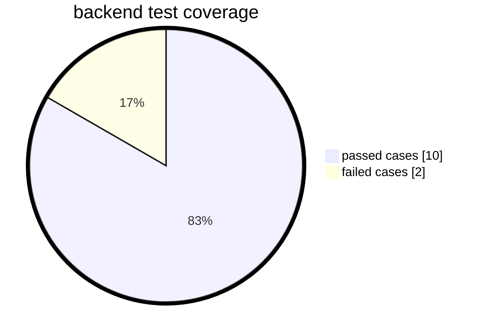

## Hi there 👋

<!--
**raja-parikchhit/raja-parikchhit** is a ✨ _special_ ✨ repository because its `README.md` (this file) appears on your GitHub profile.

Here are some ideas to get you started:

- 🔭 I’m currently working on ...
- 🌱 I’m currently learning ...
- 👯 I’m looking to collaborate on ...
- 🤔 I’m looking for help with ...
- 💬 Ask me about ...
- 📫 How to reach me: ...
- 😄 Pronouns: ...
- ⚡ Fun fact: ...
-->
<details>
<summary>test report</summary>
<div style="display: flex, width: 100%, height: 100%">
  <div style="display: flex, width: 45%">
        

        
  </div>
   <div style="display: flex, width: 45%">
         
```mermaid
%%{init: {"pie": {"textPosition": 0.5}, "themeVariables": {"pieOuterStrokeWidth": "5px"}}}%%
      pie showData
      title front end test coverage
      "passed cases": 15
      "failed cases" : 5
````
         
  </div>   
</div>

</details>
