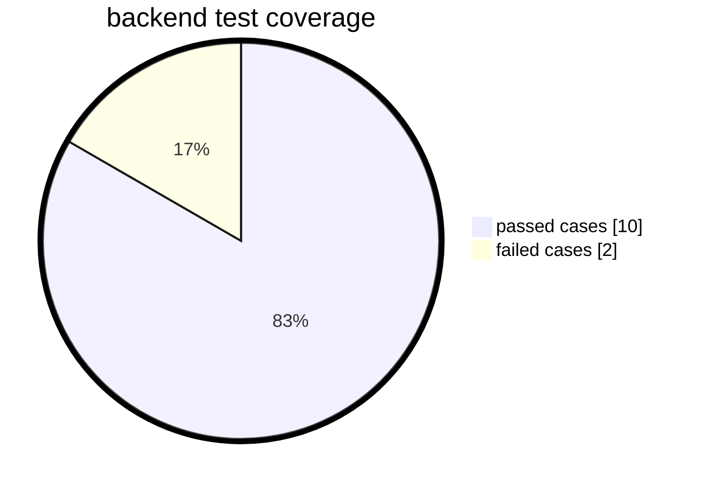

## Hi there 👋

<!--
**raja-parikchhit/raja-parikchhit** is a ✨ _special_ ✨ repository because its `README.md` (this file) appears on your GitHub profile.

Here are some ideas to get you started:

- 🔭 I’m currently working on ...
- 🌱 I’m currently learning ...
- 👯 I’m looking to collaborate on ...
- 🤔 I’m looking for help with ...
- 💬 Ask me about ...
- 📫 How to reach me: ...
- 😄 Pronouns: ...
- ⚡ Fun fact: ...
-->
<details>
Testing mermaid pie chart
<div style="display: inline-block; justify-content: space-around;">

<span style="width: 45%; display:inline">
<details>
  Backend test report

</details>                  
</span>
<details>
  front end test report
  <span style="width: 45%; display:inline">

```mermaid
%%{init: {"pie": {"textPosition": 0.5}, "themeVariables": {"pieOuterStrokeWidth": "5px"}}}%%
      pie showData
      title front end test coverage
      "passed cases": 15
      "failed cases" : 5
````       
</span>
</details>
</div>
</details>
